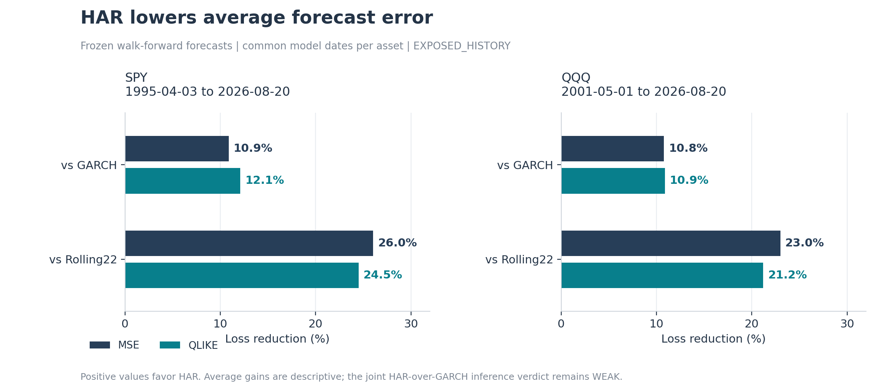
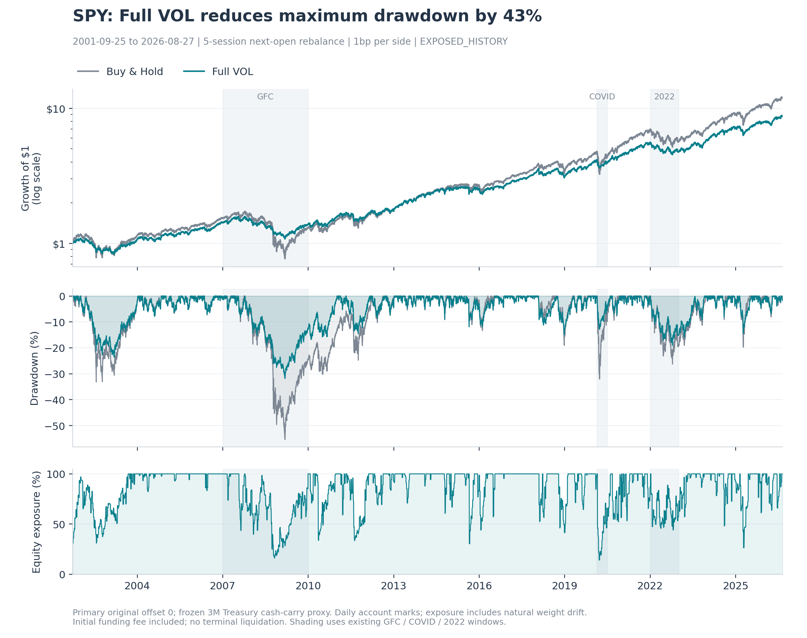
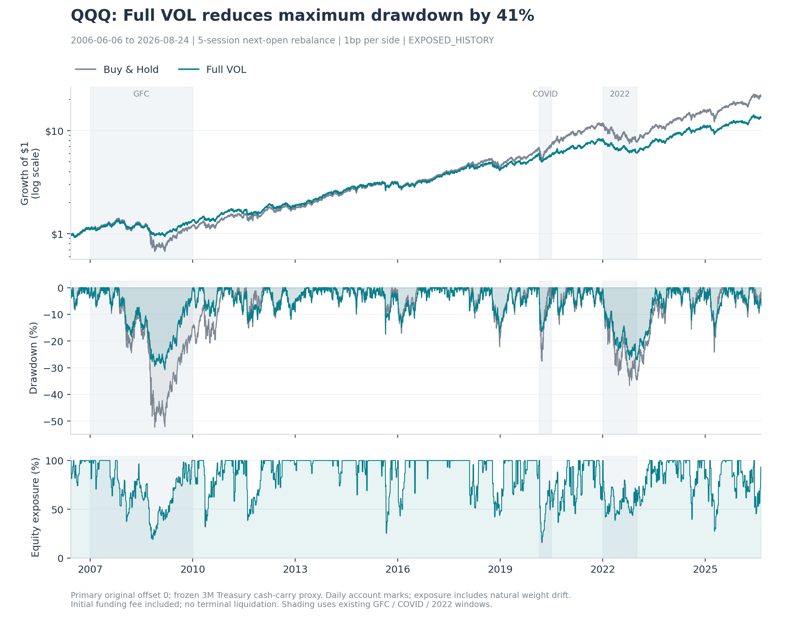
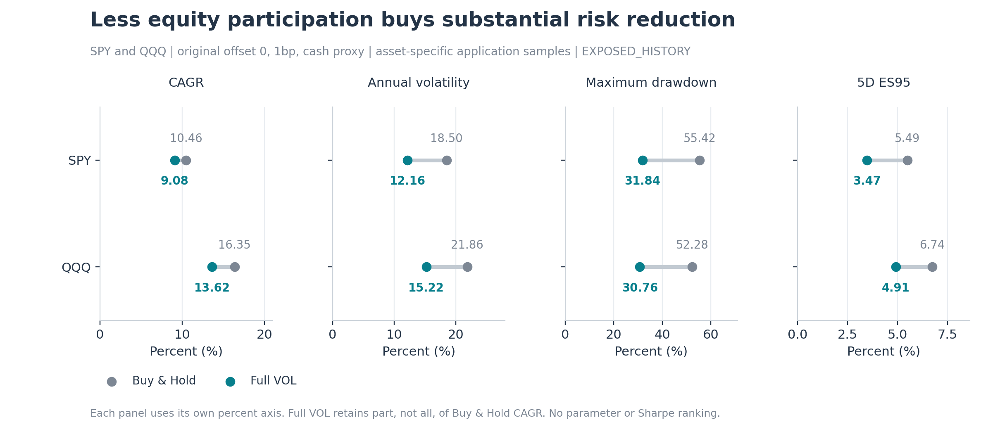
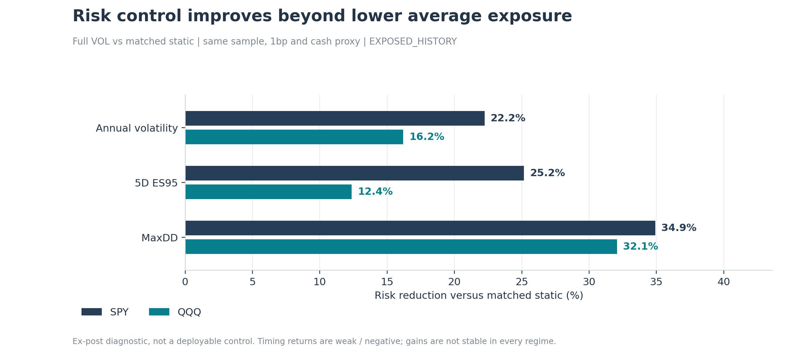
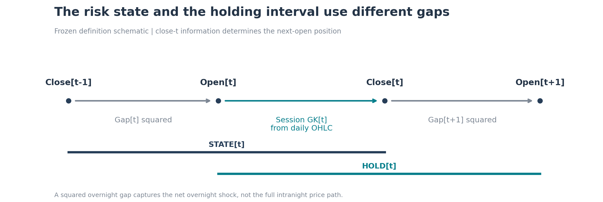
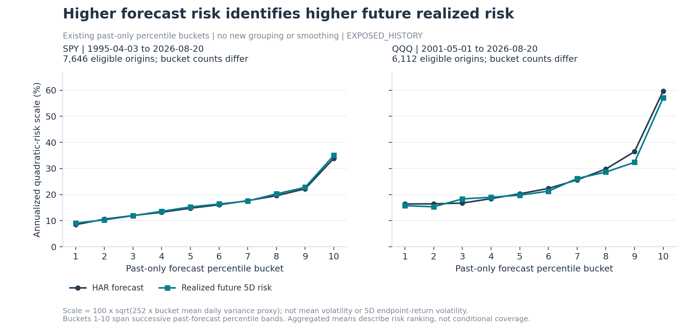

# Market Volatility Forecasting & Risk Control

**Daily OHLC supports medium-horizon risk forecasting; a simple volatility-scaled equity / Treasury-cash overlay materially reduces realized volatility and drawdown.**

Risk forecasting and risk control. **No return-timing alpha claim.** All results are retrospective **EXPOSED_HISTORY**.

### Forecasting · HAR vs training-selected GARCH

| ETF   |   MSE reduction (%) |   QLIKE reduction (%) |
|:------|--------------------:|----------------------:|
| SPY   |               10.89 |                 12.09 |
| QQQ   |               10.79 |                 10.89 |

### Risk control · Buy & Hold → Full VOL

| ETF   | Annual vol (%)   | MaxDD (%)     | 5D ES95 (%)   |
|:------|:-----------------|:--------------|:--------------|
| SPY   | 18.50 → 12.16    | 55.42 → 31.84 | 5.49 → 3.47   |
| QQQ   | 21.86 → 15.22    | 52.28 → 30.76 | 6.74 → 4.91   |

Average forecast improvements are positive; the frozen joint HAR-over-GARCH inference verdict remains **WEAK**. Risk control sacrifices some equity return. These are historical results, not prospective deployment evidence.

## What the model achieves

Lower MSE and QLIKE against both training-selected GARCH and Rolling22, on common model dates for each ETF. No baseline was selected using final test-period performance.



## A simple risk-control application

**Forecast future five-day risk → scale equity exposure → residual capital earns short-duration Treasury cash carry.**

Next-open execution every five sessions. No leverage or shorting. The figures use the original primary offset 0, 1bp per traded equity notional and the frozen 3M Treasury yield-carry proxy.

| ETF   | Account    |   CAGR (%) |   CAGR retained (%) |   Volatility (%) |   5D ES95 (%) |   MaxDD (%) |
|:------|:-----------|-----------:|--------------------:|-----------------:|--------------:|------------:|
| SPY   | Buy & Hold |      10.46 |              100.00 |            18.50 |          5.49 |       55.42 |
| SPY   | Full VOL   |       9.08 |               86.81 |            12.16 |          3.47 |       31.84 |
| QQQ   | Buy & Hold |      16.35 |              100.00 |            21.86 |          6.74 |       52.28 |
| QQQ   | Full VOL   |      13.62 |               83.25 |            15.22 |          4.91 |       30.76 |

| ETF   |   Vol reduction (%) |   MaxDD reduction (%) |   ES reduction (%) |
|:------|--------------------:|----------------------:|-------------------:|
| SPY   |               34.30 |                 42.54 |              36.73 |
| QQQ   |               30.38 |                 41.16 |              27.19 |

Account samples: SPY: 2001-09-25–2026-08-27; QQQ: 2006-06-06–2026-08-24. ES95 is five-day loss; MaxDD is a positive loss magnitude. Forecast history is longer than account history because FHS and cash eligibility require additional history.



### QQQ transfer · same framework, same decision rule, different equity ETF

The risk-budget calibration rule is identical, although its training-derived value differs by asset. QQQ is a historical transfer check, **not independent prospective validation**.





## Is this just lower average equity exposure?

**No, not entirely.** Full VOL holds less equity on average (SPY: **84.62%**; QQQ: **83.18%**), so part of its risk reduction naturally comes from lower exposure. The **ex-post matched-average-exposure static control** matches Full VOL's realized mean exposure, including drift, using the same dates, cash and costs.

| ETF   |   Vol reduction vs matched static (%) |   ES reduction vs matched static (%) |   MaxDD reduction vs matched static (%) |
|:------|--------------------------------------:|-------------------------------------:|----------------------------------------:|
| SPY   |                                 22.23 |                                25.16 |                                   34.91 |
| QQQ   |                                 16.20 |                                12.36 |                                   32.07 |

In these full-history comparisons, **dynamic volatility scaling improves risk control beyond simply maintaining a permanently lower equity allocation.**

**This does not imply return-timing alpha: the return contribution of dynamic timing is weak / negative, and the advantage is not stable across every historical regime.**



Each reduction uses the matched static account's risk as its denominator, not Buy & Hold risk. The control uses full-period information and is an attribution diagnostic, not a deployable strategy or prospective evidence. [Canonical attribution](results/strategy/HEADLINE_ATTRIBUTION.csv) preserves the underlying comparisons. The original promotion gate remains WEAK with no prospective candidate. [Full report](REPORT.md).

## How it works

Daily adjusted OHLC → session GK plus gap risk → HAR(1,5,22) → future five-day holding risk → Full VOL / cash.



$$
\begin{aligned}
\mathrm{GK}_{\mathrm{RTH},t}
&= \frac{1}{2}\left[\log\left(\frac{H_t}{L_t}\right)\right]^2
- (2\log 2 - 1)\left[\log\left(\frac{C_t}{O_t}\right)\right]^2 \\
\mathrm{GAP2}_t
&= \left[\log\left(\frac{O_t}{C_{t-1}}\right)\right]^2 \\
\mathrm{STATE}_t
&= \mathrm{GAP2}_t + \mathrm{GK}_{\mathrm{RTH},t} \\
\mathrm{HOLD}_t
&= \mathrm{GK}_{\mathrm{RTH},t} + \mathrm{GAP2}_{t+1} \\
Y_{t,5}
&= \frac{1}{5}\sum_{h=1}^{5}\mathrm{HOLD}_{t+h}.
\end{aligned}
$$

The after-close signal at $t$ controls open $t+1$ to open $t+6$; the pre-entry gap is excluded. **Gap² captures only the net overnight shock, not the full intranight price path.** This is a quadratic-risk proxy, not a squared endpoint return or complete latent overnight variance.

Monthly expanding log-HAR uses fixed 1/5/22 state averages, at least 504 mature training observations and training-only smearing. GARCH uses training-only BIC over the frozen (1,1), (1,2), (2,1), Normal/t family and the original bridge to the common holding-risk target. [Frozen protocol](GARCH_RESEARCH_PLAN.md).

$$
\widehat{v}_{t,5}^{\mathrm{HAR}}
= \widehat{s}_m\exp\left(
\widehat{\beta}_{0,m}+
\sum_{k\in\{1,5,22\}}\widehat{\beta}_{k,m}
\log\overline{\mathrm{STATE}}_{t,k}
\right).
$$

Here $m$ is the current monthly training vintage, $\overline{\mathrm{STATE}}_{t,k}$ is the mean of the latest $k$ valid risk-state observations through $t$, and $\widehat{s}_m$ is the training-only mean exponentiated log residual (smearing factor). The existing numerical variance floor is retained in the implementation.

$$
\begin{aligned}
w_t^{\mathrm{equity}}
&= \min\left(
1,
\max\left(
0,
\frac{B}{\sqrt{5 \widehat{v}_{t,5}^{\mathrm{HAR}}}}
\right)
\right), \\
w_t^{\mathrm{cash}}
&= 1 - w_t^{\mathrm{equity}}.
\end{aligned}
$$

Here $B$ is the frozen risk budget and $\widehat{v}_{t,5}^{\mathrm{HAR}}$ forecasts the mean daily holding-risk proxy $Y_{t,5}$.

The existing budget is calibrated once at the first eligible FHS vintage:

$$
B = 0.8 Q_{0.5}\left((s_\tau)_{\tau \le t_0}\right).
$$

Here $Q_{0.5}$ is the median of the past eligible risk-scale observations available at the initial calibration date $t_0$. The budget is neither newly optimized nor reset to a 15% target. The transparent self-financing engine retains units/cash, natural drift, initial funding fees, no terminal liquidation and the original five rebalance offsets; no second accounting engine is introduced.

Cash uses the frozen DGS3MO 3M Treasury **yield-carry approximation**: at least two prior stock sessions, maximum seven-calendar-day quote age, ACT/365 carry locked for each block. It is not an executable T-bill total-return index. Release-vintage provenance remains PARTIAL. Stale quotes are not filled; the original SPY September-2001 eligibility break is retained. ZERO cash and 0/1/3bp costs remain in the full [SPY results](results/strategy/SPY/PORTFOLIO_RESULTS.csv) and [QQQ results](results/strategy/QQQ/PORTFOLIO_RESULTS.csv).

## Forecast validation · higher predicted risk, higher future risk



This plot reuses the existing past-only percentile buckets; it does not regroup the sample. Each point shows

$$
\mathrm{RiskScale}_b (\%) = 100\sqrt{252 \overline{v}_b},
$$

where $\overline{v}_b$ is the bucket mean daily variance proxy. It is an annualized quadratic-risk scale, not the volatility of a five-day endpoint return. The mean curves show risk ranking and average calibration; they are not confidence bands.

Daily input history spans SPY 1993–2026 and QQQ 1999–2026. Mature forecast windows and account start dates differ. [Coverage](results/forecast/DATA_COVERAGE.csv), [forecast/regime scores](results/forecast/BENCHMARK_METRICS.csv) and [paired 21/42-session block intervals](results/forecast/BENCHMARK_PAIRED_INTERVALS.csv) retain full history, crisis windows, recent periods and exclusions. Positive average loss improvements do not imply uniform outperformance across every regime.

## Tail-risk interpretation

Filtered Historical Simulation (FHS) uses $\sqrt{5 \widehat{v}_{t,5}^{\mathrm{HAR}}}$ to scale mature empirical five-day standardized returns and six-open drawdown paths. The fixed expanding history, 1,008-observation minimum and monthly updates remain unchanged. It adds useful VaR, ES, loss-probability and path-risk information over unfiltered HS: [tail scores](results/tail/HEADLINE_METRICS.csv).

Volatility scale captures much of the useful dynamic tail information; a separate dynamic standardized left-tail state was not supported. Rare >5% losses have weaker inference than the primary >2% event. Distribution width and downside scale are more predictable here than return mean or direction.

## What did not add stable value

| Extension | Question | Verdict | Why retired |
| --- | --- | --- | --- |
| Intraday / refined RV | Measurement detail? | Weak | No stable portfolio increment over daily GK |
| Extra risk predictors | More structure? | Weak / not supported | No stable incremental value |
| Gold / Treasury transfer | Cross-asset forecasting? | Mixed | HAR-over-GARCH unconfirmed; GC data blocked |
| Dependence / cDCC | Better decisions? | Weak | Limited covariance/portfolio value |
| Return direction | Return timing? | Not supported | No stable predictive increment |
| Dynamic tail shape | Another mapping? | Weak | Simple scale remained most interpretable |
| Treasury parking | Replace cash? | Weak | No stable conditional gain; adverse 2022 evidence |
| Gold / multi-asset allocation | Broader architecture? | Not promoted | Strategic diversification was historically useful, but dynamic allocation lacked robust increment for this single-asset project |
| Long-horizon / term-structure risk | Combine 5D and 21D? | Not promoted | 21D risk was forecastable and benefited from sequential reforecasting, but nearly collinear signals did not improve the 5D portfolio |

[Research history](RESEARCH_HISTORY_SUMMARY.md) and [post-convergence summary](POST_CONVERGENCE_RESEARCH_SUMMARY.md) preserve qualified findings and closed gates.

## Limitations

Historical selection bias survives walk-forward design and bootstrap. Yahoo adjustments may be revised; adjusted-unit accounting does not establish historical auction fills or impact. Duration-sensitive Treasury ETFs can fall alongside equities and are not risk-free cash. The cash proxy and GK overnight representation have the limits described above. No evidence here authorizes deployment, and the existing FULL_HAR prospective shadow is unchanged.

## Reproduction

```powershell
python -m pip install -r requirements-lock.txt
python -B scripts/reproduce.py --output artifacts/reproduction
python -B -m pytest -q
python -B scripts/audit.py
```

Use a new or empty output directory and the hash-matching [local inputs](data/README.md); raw observations are not redistributed. Default reproduction reruns frozen specifications. `--frozen-forecast` reuses verified marginal forecasts while reproducing FHS/accounts. To redraw only, run `python -B scripts/render_presentation.py --source artifacts/canonical_final --output artifacts/presentation_preview`. Neither entry downloads data or changes models.

Headlines and figures are generated from canonical tables. [Presentation provenance](results/figures/PRESENTATION_PROVENANCE.json) · [refinement notes](PRESENTATION_REFACTOR.md) · [validation](VALIDATION.md) · [project structure](FINAL_PROJECT_STRUCTURE.md).
